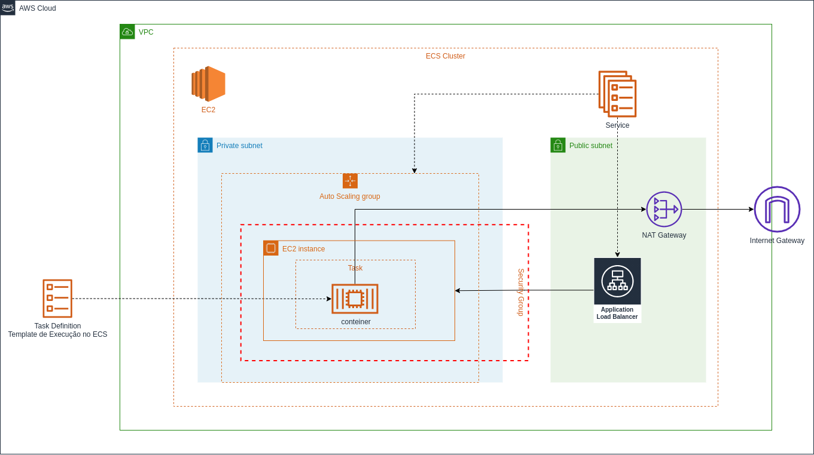
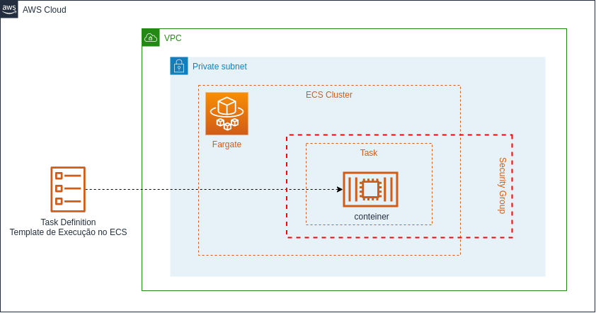

# AWS Elastic Container Service (ECS)

A orquestração eficiente de contêineres Docker é essencial para maximizar a escalabilidade e a flexibilidade das aplicações hospedadas em ambiente de nuvem. 

Neste estudo, vamos explorar o Amazon Elastic Container Service (ECS), um serviço robusto da AWS para orquestração de contêineres que simplifica a implantação e o gerenciamento.

## Infraestrutura do ECS

- **Cluster**:

  - Agrupamento lógico de instâncias EC2 ou serviços Fargate (Serveless) onde os contêinteres serão executados.
  - Os clusters fornecem recursos computacionais para execução dos contêineres e são escaláveis horizontalmente para lidar com variações de carga.

- **Instâncias EC2**:

  - Máquinas virtuais que compõem o cluster, oferecendo a capacidade computacional necessária para execução dos contêineres.
  - Permitem maior controle sobre o ambiente de execução dos contêineres, incluindo escolha de tipo de instância, configurações de rede e otimizações de recursos.

## Definições de Tarefa (Task Definitions)  

- Especificam como os contêineres devem ser executados, incluindo recursos, variáveis de ambiente e configurações.
- Permitem definir parâmetros como imagem do contêiner, portas expostas, volumes e dependências entre contêineres.

## Tarefas (Tasks)

- Instâncias individuais de definições de tarefa, cada uma executando um ou mais contêineres.
- Podem ser consideradas unidades básicas de execução no ECS, com cada tarefa representando uma única execução de um grupo de contêineres.
- *Podemos fazer um paralelo das Tasks ECS com os PODs do Kubernetes*.

## Serviços (Services)

- Gerenciam e escalonam automaticamente tarefas ao longo do tempo, garantindo que o número desejado esteja sempre em execução.
- Permitem definir políticas de escalabilidade automática com base em métricas como CPU ou uso de memória.

### Escalabilidade:

- Possibilidade de escalar horizontalmente via **Auto Scaling** adicionando ou removendo instâncias EC2 ou usando o serviço Fargate.
- Oferece flexibilidade para lidar com variações de carga via **Load Banlancer** e garantir que a aplicação permaneça disponível e elástica.

## ECS Agent

O ECS Agent é um componente essencial no Amazon ECS (Elastic Container Service), sendo responsável por se comunicar com o serviço ECS da AWS e gerenciar os contêineres em uma instância EC2 ou em um ambiente Fargate.

O papel do ECS Agent é fundamental para o funcionamento adequado do ECS, pois ele permite que as instâncias EC2 e tarefas Fargate sejam registradas e gerenciadas pelo serviço ECS. 

O ECS Agent executa várias funções-chave, incluindo:

- **Registro de Instância**: O ECS Agent registra a instância EC2 com o serviço ECS, permitindo que ela seja incluída em um cluster ECS. Isso permite que o ECS coloque tarefas em instâncias EC2 e monitore sua saúde.

- **Gerenciamento de Tarefas**: O ECS Agent é responsável por iniciar, parar e monitorar os contêineres que compõem as tarefas do ECS. Ele executa essas ações com base nas definições de tarefa fornecidas pelo usuário e nas instruções recebidas do serviço ECS.

- **Comunicação com o Serviço ECS**: O ECS Agent mantém uma comunicação contínua com o serviço ECS para receber instruções, relatar o estado da instância e fornecer atualizações sobre a execução das tarefas.

Em resumo, o ECS Agent desempenha um papel importante na integração entre as instâncias EC2 (ou ambiente Fargate) e o serviço ECS, garantindo que os contêineres sejam gerenciados de forma eficiente e confiável dentro do ambiente ECS.

## ECS Fargate: Simplificando a Execução de Contêineres

- **Infraestrutura Serverless (sem servidor)**:

  - Elimina a necessidade de gerenciar instâncias EC2, concentrando-se apenas nos contêineres.
  - Permite que os desenvolvedores se concentrem exclusivamente na lógica da aplicação, sem se preocupar com a infraestrutura subjacente.

- **Escalabilidade Automática**:

  - Escala automaticamente com base nas necessidades dos contêineres, oferecendo simplicidade e eficiência.
  - Reduz a complexidade operacional e garante que os recursos sejam provisionados de forma dinâmica de acordo com a demanda da aplicação.

## ECS EC2 vs ECS Fargate
Vamos comparar as possiblidades de infraestrutura suportadas pelo ECS.

### ECS EC2

- **Necessita de gerenciamento manual de recursos**:
  - Oferece mais controle sobre a infraestrutura, permitindo ajustes específicos de acordo com as necessidades da aplicação.
  - Requer configuração e gerenciamento de instâncias EC2, incluindo provisionamento, monitoramento e manutenção.
- **Necessita de escolha de perfil de máquina**:
  - É necessário selecionar o tipo de instância EC2 mais adequado para a carga de trabalho, levando em consideração requisitos de CPU, memória, armazenamento e rede.
- **Recomendado para execuções contínuas**:
  - Mais adequado para cargas de trabalho com demanda estável e previsível, onde a personalização e o controle granular são prioritários.
  - Indicado para cargas de trabalho com requisitos específicos de hardware ou que demandem configurações personalizadas.

  

### ECS Fargate (Serveless)

- **Exige menor gerenciamento de recursos em relação ao EC2**:
  - Elimina a necessidade de gerenciar instâncias EC2, simplificando significativamente a operação e manutenção do ambiente.
- **Recomendado quando há escalas pontuais e necessidade de maior elasticidade**:
  - Ideal para cargas de trabalho com picos de demanda, onde a capacidade de escalar rapidamente e de forma automática é essencial.
- **Recomendado para microserviços, workers de mensageria**:
  - Fargate é especialmente indicado para a execução de microserviços e workers de mensageria, onde a abstração da infraestrutura e a escalabilidade automática são altamente vantajosas."

  

  ### ECS Spot: Economia de Custos com Instâncias Spot

- **Utilizando Instâncias Spot**:
  - Integração que aproveita as instâncias Spot para proporcionar economias significativas de custos.
  - As instâncias Spot são disponibilizadas a preços mais baixos, mas podem ser interrompidas a qualquer momento sem aviso prévio.
- **Considerações de Tolerância a Interrupções**:
  - Adequado para cargas de trabalho tolerantes a interrupções devido à natureza das instâncias Spot, como testes, protótipos, etc.
  - É importante projetar aplicações para lidar com a interrupção e reinicialização de instâncias Spot de forma transparente e sem impacto significativo na operação.

### Matriz de Decisão
A matriz de decisão abaixo pode ajudar arquitetos e desenvolvedores a avaliar os prós e contras de cada opção (ECS com EC2 e ECS Fargate) com base nos critérios relevantes para o seu caso de uso específico.

| Aspecto | ECS com EC2 | ECS Fargate | ECS Spot |
|---------|-------------|-------------|----------|
| Controle sobre a infraestrutura | Alto controle, instâncias EC2 gerenciadas diretamente | Baixo controle, AWS gerencia a infraestrutura | Alto controle, uso de instâncias Spot |
| Escalabilidade | Horizontalmente, adicionando ou removendo instâncias EC2 | Automática, gerenciada pela AWS | Automática, aproveitando instâncias Spot |
| Gestão de instâncias | Necessária, incluindo monitoramento e manutenção | Não é necessário, AWS gerencia a infraestrutura | Gerenciada pela AWS, incluindo lidar com instâncias Spot |
| Custos | Depende do tipo e número de instâncias EC2 utilizadas | Baseado no consumo de recursos, sem custos de instâncias EC2 | Potencialmente mais econômico ao utilizar instâncias Spot |
| Complexidade | Mais complexo de configurar e gerenciar | Mais simples de configurar e gerenciar | Menos complexo em comparação com ECS com instâncias on-demand |

## Estrutura de Rede Recomendada
Ao utilizar o ECS com EC2 ou Fargate, é importante configurar uma estrutura de rede adequada para garantir segurança e eficiência. Algumas práticas recomendadas incluem:

- **VPC e Subnets**:
  - Configure uma VPC e subnets para ambas as opções.
  - Utilize subnets públicas e privadas para segmentar recursos e garantir isolamento de rede.

- **Internet Gateway (para EC2)**:
  - Associe um Internet Gateway para instâncias EC2 em subnets públicas, permitindo comunicação com a internet.

 - **Nat Gateway (para EC2)**:
  - Utilize NAT Gateway em subnets privadas para permitir que instâncias EC2 em subnets privadas acessem a internet de forma segura, sem expor seus endereços IP privados diretamente à internet.

- **Route Tables (para EC2)**:
  - Configure tabelas de rotas para direcionar o tráfego adequadamente dentro da VPC.
  - Em uma subnet pública, defina uma rota padrão que aponte para o Internet Gateway, permitindo que instâncias EC2 na subnet acessem a internet.
  - Em uma subnet privada, defina uma rota padrão que aponte para o NAT Gateway, permitindo que instâncias EC2 na subnet acessem a internet de forma segura.

- **Security Groups**:
  - Configure Security Groups para controlar tráfego de entrada e saída, garantindo segurança em ambos os casos.
  - Defina regras de segurança para permitir apenas o tráfego necessário para a aplicação e restringir acessos não autorizados.

- **Load Balancer**:
  - Integre ALB (balanceamento sobre aplicação) ou NLB (balanceamento sobre a rede) conforme necessário para distribuir tráfego de forma eficiente e garantir alta disponibilidade da aplicação.
  - Utilize Load Balancers para distribuir o tráfego entre as instâncias EC2 ou tarefas do Fargate, garantindo escalabilidade e resiliência.

- **Comunicação entre EC2 e Fargate**:
  - Configure regras de segurança para permitir comunicação se estiverem na mesma VPC.
  - Utilize VPC Peering ou AWS PrivateLink se for necessário comunicação entre VPCs ou serviços AWS.

### Configurar Componentes de Rede no ECS Fargate: Entenda se é Necessário ou Desnecessário

Vale observar que componentes de rede como Internet Gateway, NAT Gateway e tabelas de rotas se aplicam apenas para instâncias EC2 e não para tarefas Fargate no Amazon ECS.

Esses componentes de rede são específicos para instâncias EC2 em uma VPC da AWS e são utilizados para controlar o tráfego de rede dentro e fora da VPC. No entanto, o Fargate é um serviço "sem servidor" que executa tarefas em contêineres Docker gerenciados pela AWS, sem exigir uma gestão direta às instâncias EC2.

Quando se utiliza o Fargate no Amazon ECS, a AWS gerencia a infraestrutura subjacente, incluindo a alocação de recursos, a escalabilidade e o gerenciamento da rede. Como resultado, não há a necessidade de configurar ou gerenciar componentes como Internet Gateway, NAT Gateway ou tabelas de rotas, pois isso é tratado automaticamente pelo serviço Fargate. Isso permite a concentação apenas na definição e execução das tarefas em contêineres.

## Conclusão

O Amazon ECS emerge como uma poderosa solução para orquestração de contêineres na AWS. Seja utilizando EC2 para controle granular ou optando pela simplicidade do Fargate.

Oferece flexibilidade e escalabilidade para atender às demandas variadas das aplicações modernas. Ao compreender a estrutura e os recursos do ECS, os desenvolvedores podem otimizar suas implementações e impulsionar o desempenho de suas aplicações na nuvem.

