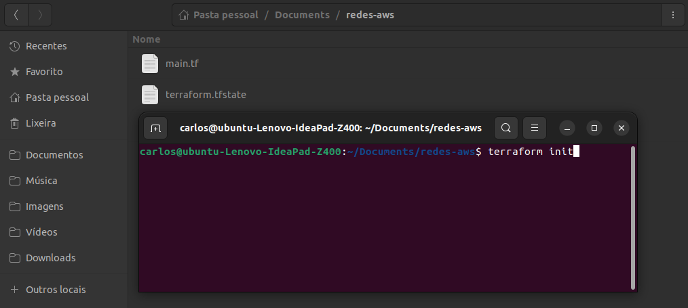

# Conceitos de Redes na AWS

Na AWS, redes referem-se à infraestrutura de comunicação que permite a conectividade e o isolamentoentre os diversos serviços e recursos hospedados na nuvem.

A AWS oferece uma variedade de serviços e ferramentas para configurar redes, como o Amazon VPC (Virtual Private Cloud), que permite criar redes isoladas e personalizadas na nuvem.

Através de recursos como subnets e security groups (grupos de segurança), é possível projetar arquiteturas de rede flexíveis e escaláveis para atender às necessidades específicas das aplicações.

Além disso, a presença global da AWS é suportada por regiões, como US East, e cada região é composta por múltiplas Zonas de Disponibilidade (AZs), proporcionando redundância e resiliência. 

Ao utilizar as regiões e AZs estrategicamente, os usuários podem projetar arquiteturas de rede robustas que garantem desempenho e alta disponibilidade para suas aplicações na nuvem.

A rede na AWS desempenha um papel crucial na garantia de desempenho, segurança e alta disponibilidade para as aplicações e dados hospedados na plataforma.


## Regions (Regiões)

Na AWS, uma region refere-se a uma localização geográfica específica que abriga data centers. Cada região é composta por múltiplas Zonas de Disponibilidade, oferecendo redundância e permitindo a distribuição global de recursos em uma plataforma de nuvem.


## Availability Zones (Zonas de Disponiblidade)

Tratam-se data centers fisicamente separados, mas interconectados, dentro de uma região, sendo que cada possui energia, rede e conectividade redundantes. 

Estratégicamente localizadas a uma distância significativa, até 100 km, essas zonas são separadas estrategicamente para garantir backups seguros e oferecer resiliência contra desastres, aproveitando a separação física para assegurar redundância e aumentar a confiabilidade da infraestrutura na nuvem.


## VPC - Virtual Privte Cloud

Uma Virtual Private Cloud (VPC) na AWS é um ambiente de rede isolado na nuvem que permite o provisionamento de recursos, como instâncias EC2, bancos de dados RDS, etc. 

As VPCs possibilitam a definição de políticas de segurança, roteamento e controle de acesso, fornecendo uma infraestrutura personalizada e segura para implantação de aplicações na nuvem.

Vale lembrar que uma VPC está sempre vinculada a uma região específica da AWS, e cada região suporta até 5 VPCs, proporcionando flexibilidade e controle sobre sua infraestrutura na nuvem.


## Subnet

Uma subnet na AWS é uma subdivisão de uma Virtual Private Cloud (VPC), permitindo a segmentação de recursos em diferentes redes. 

Cada subnet está associada a uma zona de disponibilidade e pode ser configurada como pública ou privada, determinando sua acessibilidade direta pela internet. 

Toda subnet é vinculada a uma VPC, proporcionando um contexto isolado dentro da infraestrutura na nuvem.


### Subnet Pública

Uma subnet pública é uma parte de uma rede na nuvem configurada para ter acesso direto à internet. Geralmente, é usada para hospedar recursos que precisam ser acessíveis publicamente, como servidores web. 

Essas subnets são configuradas para permitir que instâncias associadas recebam IPs públicos automaticamente, facilitando a comunicação com a internet.


### Subnet Privada

Uma subnet privada é um segmento isolado de uma rede em nuvem que não possui acesso direto à internet. É projetada para hospedar recursos que não precisam ser acessíveis publicamente, como bancos de dados ou servidores de aplicativos internos. 

As instâncias em uma subnet privada podem se comunicar com a internet por meio de um serviço intermediário, como um NAT (Network Address Translation), garantindo maior segurança para dados sensíveis.


### CIDR Block

*CIDR (Classless Inter-Domain Routing)* é uma forma de representar e especificar ranges de endereços IP. É comumente usado para definir o tamanho de uma rede. 

Vamos pegar um exemplo simples:

- Endereço IP: 192.168.0.0
- CIDR: 192.168.0.0/24

No exemplo acima, o "192.168.0.0" é o endereço inicial da sua rede e "/24" indica que os primeiros 24 bits são a parte da rede (o que deixa 8 bits para endereços individuais dentro da rede). 

Em termos simples, isso significa que temos 256 endereços disponíveis para dispositivos em nossa rede porque **2^8 = 256**.

Então, se tivermos um dispositivo com o endereço IP "192.168.0.1" e outro com "192.168.0.2", eles fazem parte da mesma rede porque compartilham os primeiros 24 bits do endereço IP. 

O CIDR ajuda a definir esses limites de forma clara e eficiente, permitindo um gerenciamento eficaz dos endereços IP em uma rede.

Se tivermos um CIDR de /16, isso significa que os primeiros 16 bits do endereço IP são reservados para identificar a rede, e os restantes 16 bits são deixados para endereços individuais dentro dessa rede.

Por exemplo:

- Endereço IP: 192.168.0.0
- CIDR: 192.168.0.0/16

Nesse caso, teriamos um espaço de endereçamento muito maior do que o exemplo anterior. Com /16, teremos **2^16 = 65.536** endereços disponíveis para dispositivos dentro da sua rede (porque há 32 bits em um endereço IP e 32 - 16 = 16 bits restantes para endereços individuais).

Então, se tiver um dispositivo com o endereço IP "192.168.1.1" e outro com "192.168.1.2", eles ainda fazem parte da mesma rede porque compartilham os primeiros 16 bits do endereço IP. O CIDR /16 permite uma grande quantidade de endereços, adequando-se a redes maiores.

O número após a barra (/) indica a quantidade de bits usados para identificar a rede.

### Entendendo o Cálculo

O cálculo CIDR envolve a determinação do número de bits reservados para identificar a rede em uma notação como /8, indicando a quantidade de endereços disponíveis. Por exemplo, em CIDR 8, 2^32-8 revela 16.777.216 endereços IP.

Alguns exemplos comuns incluem:

- /32: Usado para identificar um endereço IP específico.
- /24: Muito comum para redes locais, permitindo até 256 endereços.
- /16: Usado para redes de médio porte, permitindo até 65.536 endereços.
- /8: Reservado para redes muito grandes, permitindo até 16.777.216 endereços.

O cálculo pode ser obtido conforme abaixo:

**Para CIDR /8:**

- 2^32-8 = 2^24 = 16.777.216
- 2^32-8 = 2^24 = 2×2×2×…×2 (24 vezes) = 16.777.216

**Para CIDR /16:**

- 2^32-16 = 2^16 = 65.536
- 2^32-16 = 2^16 = 2×2×2×…×2 (16 vezes) = 65.536

**Para CIDR /24:**

- 2^32-24 = 2^8 = 256
- 2^32-24 = 2^8 = 2×2×2×…×2 (8 vezes) = 256

Isso significa que um bloco de CIDR /8 tem 16.777.216 endereços IP, um bloco de CIDR /16 tem 65.536 endereços IP, e um bloco de CIDR /24 tem 256 endereços IP. 

O número após a barra (/) representa quantos bits são usados para identificar a rede, e a fórmula **2^32-x**  mostra quantos endereços IP isso representa. 

Quanto menor o número após a barra (/), maior é o bloco de endereços IP.

### Dividindo as subnets

O tamanho do bloco CIDR influencia na quantidade de subnets que se pode criar, pois determina a quantidade total de endereços IP disponíveis para uma VPC e, por consequentemente, para as subnets. 

Entender como subdividir esse espaço de endereços é fundamental para decidir o número e o tamanho das subnets.

Vamos usar um exemplo para ilustrar, suponhamos que tenhamos uma VPC com CIDR "10.0.0.0/16", o que nos dá 65.536 endereços IP disponíveis.

Agora, decidimos criar subnets dentro dessa VPC, sendo que cada subnet terá seu próprio bloco CIDR dentro do bloco principal da VPC. Se criarmos subnets com CIDR /24, cada uma dessas subnets terá 256 endereços IP disponíveis.

Por exemplo:

- Subnet 1: "10.0.1.0/24"
- Subnet 2: "10.0.2.0/24"
- Subnet 3: "10.0.3.0/24"

Se optarmos por subnets menores com CIDR /25, cada subnet terá 128 endereços IP disponíveis.

Por exemplo:

- Subnet 1: "10.0.1.0/25"
- Subnet 2: "10.0.1.128/25"
- Subnet 3: "10.0.2.0/25"

Se tivermos uma VPC com CIDR 10.0.0.0/16 e criarmos subnets com CIDR 10.0.0.0/24, a diferença nos bits de host entre o CIDR da VPC e o das subnets é 8 bits (24 - 16). Isso significa que poderemos criar 2^8 subnets, ou seja, 256 subnets e cada uma dessas subnets terá 256 endereços IP disponíveis para alocação.

Portanto, o tamanho do bloco CIDR influencia indiretamente na quantidade de subnets, pois determina a quantidade total de endereços IP disponíveis para a VPC, e você precisa decidir como subdividir esse espaço para criar suas subnets.

### Atribuindo IPs conforme range

Caso tenhamos uma VPC com um CIDR "192.168.0.0/16" e uma subnet específica com CIDR "192.168.1.0/24", aqui está um exemplo de como os endereços IP para a uma aplicação ECS e a uma instância EC2 na mesma rede poderiam ser atribuídos:

- **ECS**: "192.168.1.1"
- **EC2**: "192.168.1.2"

Ambos os endereços compartilham os primeiros 24 bits ("192.168.1") devido à configuração da subnet, e os últimos 8 bits são usados para diferenciar os hosts na subnet.

Vale lembrar que devemos garantir que os endereços IP atribuídos sejam únicos dentro da subnet. Se houver mais dispositivos ou serviços, os últimos bits variarão para cada um, mantendo a consistência com o CIDR da subnet. Por exemplo:

**Outro dispositivo**: "192.168.1.3"
**Outro serviço**: "192.168.1.4"

Esses endereços ainda compartilham a parte de rede "192.168.1", mas os últimos bits são diferentes para garantir unicidade dentro da subnet.


## Internet Gateway (IGW)

O *Internet Gateway (IGW)* é um componente VPC que permite que instâncias com IPs públicos acessem a internet diretamente **entrada e saída (Inbound e Outbound)**, possibilitando interações bidirecionais com recursos externos. 

Isso significa que as instâncias na subnet pública podem servir conteúdo para usuários da internet e também buscar informações ou atualizações diretamente da web, tornando-as ideais para aplicativos web públicos.


## NAT Gateway (NGW)

O *NAT Gateway (NGW)* é um serviço gerenciado de Network Address Translation (NAT) e desempenha um papel crucial, permitindo que instâncias sem IPs públicos acessem a internet de forma segura **somente saída (Outbound)**, mantendo suas informações de identificação internas protegidas contra exposição direta. 

O NAT Gateway faz algo semelhante ao Internet Gateway (IGW), mas só funciona de uma maneira, as instâncias em uma sub-rede privada podem se conectar a serviços fora da VPC, mas os serviços externos não podem iniciar uma conexão com essas instâncias.

Isso é especialmente útil para manter ambientes corporativos seguros, onde as operações internas podem ocorrer sem a necessidade de exposição direta à internet.


## Seurity Group


## Descomplicando a Estrutura de Rede na AWS 

Podemos pensar na AWS como o local onde está situada uma agência bancária moderna, sendo a VPC equivalente à própria agência. 

Dentro desse espaço, as subnets públicas são como os balcões de atendimento ao cliente e caixas, acessíveis ao público, enquanto as subnets privadas representam áreas mais restritas, como a tesouraria e informações confidenciais.

A Route Table atua como um guia interno, direcionando o tráfego de informações entre essas áreas. O Internet Gateway funciona como a entrada principal, permitindo que os clientes acessem serviços bancários online de maneira segura e conveniente. 

Similar a uma agência bancária, o NAT Gateway age como um canal seguro para comunicações sensíveis entre os setores internos e o ambiente externo.

Podemos considerar as regions como diferentes cidades as agências estão situadas, e cada zona de disponibilidade (AZ) dentro de uma region é como um bairro independente. 

Por exemplo, a agência na "region" de São Paulo tem suas subnets distribuídas nas "zonas de disponibilidade" como sendo bairros distintos.


## Criando os recursos na AWS

Após concluir o código acima, executar os comandos Terraform abaixo para iniciar, planejar e aplicar os recursos declarados:

**Observação:** Execute os comandos via terminal dentro da pasta onde o arquivo Terraform *main.tf* se encontra.



```hcl
# Inicia o Terraform e instala os componentes de acordo com os recursos declarados que serão criados
terraform init 
```

```hcl
# Apresenta o plano dos recursos que serão criados de acordo com a receita Terraform
terraform plan
```

```hcl
# Aplica a criação dos recursos conforme o planejamento acima, porém, sem solicitar confirmação
terraform apply -auto-approve
```

Após a execução com sucesso dos comandos acima, espera-se que os recursos definidos nessa trilha tenham sido provisionados.
